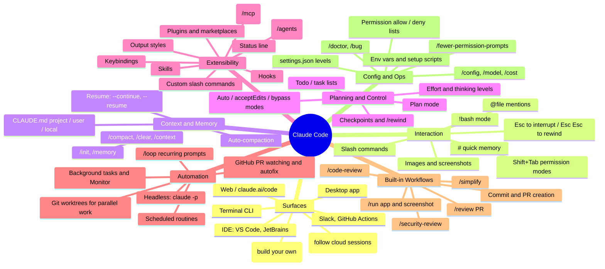

# Claude Code: Feature Map and Productivity Guide

A map of Claude Code's features (slash commands, hooks, workflows, integrations, and more), grouped so you can pick the ones that save you the most time.

> For the Agent SDK, plugins, MCP servers and connectors, see `claude-code-sdk-plugins-mcp-guide.md`.

> Features change quickly. Run `/help` in your own install to see the exact commands your version has, and check https://code.claude.com/docs for the current reference.

---

## 1. Mind Map



---

## 2. Slash Commands (most useful)

| Command | What it does | Why you'd use it |
|---|---|---|
| `/help` | Lists every command in your install | Start here |
| `/init` | Scans the repo and writes a `CLAUDE.md` | One-time setup per project: better answers from then on |
| `/memory` | Opens your memory / CLAUDE.md files to edit | Save rules once instead of repeating them |
| `/clear` | Starts with a fresh context | Switching tasks; stops old context from confusing new work |
| `/compact [focus]` | Summarizes the conversation to free up context | Long sessions; you can tell it what to keep |
| `/context` | Shows what's using up the context window | Find out why a session is getting slow or forgetful |
| `/rewind` (or `Esc Esc`) | Goes back to an earlier checkpoint (code and/or chat) | Undo a wrong turn safely |
| `/resume` | Picks up a past session | Continue yesterday's work |
| `/model` | Switches model | Faster model for simple work, stronger model for hard problems |
| `/config` | Theme, defaults, settings UI | |
| `/permissions` | Manages allow / deny rules for tools | Fewer prompts for commands you trust |
| `/agents` | Creates and manages subagents | Specialists with their own focused context |
| `/mcp` | Manages MCP server connections (and their auth) | Connect GitHub, databases, Notion, browsers, and more |
| `/hooks` | Views and configures hooks | Automate checks |
| `/plugin` | Browses and installs plugins from marketplaces | Get other people's commands, agents, and hooks in one install |
| `/code-review [level]` | Reviews your diff or a PR for bugs (`--fix`, `--comment`) | Catch bugs before you push |
| `/security-review` | Security review of the changes on your branch | Before merging anything sensitive |
| `/simplify` | Cleans up changed code: reuse, simplification, efficiency | Tidy up after a feature is working |
| `/loop [interval] <prompt>` | Runs a prompt on a repeating interval | "Check the deploy every 5m", babysit PRs |
| `/run` | Starts and drives your app to check a change | See the change working, not just passing tests |
| `/fewer-permission-prompts` | Builds an allowlist from your usage history | Removes the most common interruptions |
| `/statusline` | Builds a custom status bar (branch, model, cost…) | Useful info always on screen |
| `/output-style` | Changes the response style (e.g. explanatory, learning) | Learning a new codebase or language |
| `/cost`, `/usage` | Shows token use, spend, and plan limits | Keep track of usage |
| `/doctor` | Checks your install | When something breaks |
| `/terminal-setup` | Sets up Shift+Enter for new lines, etc. | One-time quality-of-life fix |
| `/vim` | Vim keybindings in the prompt | If you use Vim |
| `/add-dir` | Adds another directory to the session | Work across several repos together |
| `/export` | Exports the conversation | Share or archive a session |

**Custom commands:** put a markdown file in `.claude/commands/<name>.md` (shared with the project) or `~/.claude/commands/` (just you), and you can run it as `/<name>`. It accepts `$ARGUMENTS`. This is the easiest way to turn a prompt you keep retyping into one command.

---

## 3. Prompt Shortcuts

| Input | Effect |
|---|---|
| `@path/to/file` | Pulls a file or folder into context |
| `!git status` | Runs a shell command directly; the output goes into context |
| `# always use pnpm` | Saves a line to memory quickly |
| `Shift+Tab` | Cycles permission modes (default → accept edits → plan → auto) |
| `Esc` | Stops Claude mid-action |
| `Esc Esc` | Rewind menu |
| `Ctrl+R` | Searches your prompt history |
| `Ctrl+B` | Moves a running command to the background |
| Paste or drag an image | Screenshots of UI bugs, designs, error dialogs |
| "think" / "think hard" / "ultrathink" | Asks for deeper reasoning on hard problems |

---

## 4. Memory: CLAUDE.md

| Location | Scope |
|---|---|
| `~/.claude/CLAUDE.md` | You, in every project |
| `./CLAUDE.md` | The project, committed and shared with the team |
| `./CLAUDE.local.md` / `.claude/settings.local.json` | You, in this project only, not committed |
| Subdirectory `CLAUDE.md` | Loaded when Claude works in that folder |

**What to put in it:** build, test, and lint commands, code style rules, "never do X", architecture notes, and the names of key files. Use `@path` imports to pull in other docs. **This is the single biggest productivity gain.**

---

## 5. Hooks: automation the harness guarantees

Hooks are shell commands (or prompts) that the harness runs on events, so they run every time instead of relying on Claude to remember. You configure them in `settings.json` or with `/hooks`.

| Event | Fires when | Example use |
|---|---|---|
| `PreToolUse` | Before a tool runs (can block it) | Block `rm -rf` and edits to `.env` or lockfiles |
| `PostToolUse` | After a tool runs | Run Prettier / ESLint / `ruff format` after every edit |
| `UserPromptSubmit` | You send a prompt | Add context (current ticket, date), filter secrets |
| `Stop` / `SubagentStop` | Claude finishes a turn | Run tests; desktop notification "done" |
| `Notification` | Claude needs your input | Ping your phone or desktop when it's waiting on you |
| `SessionStart` | Session starts or resumes | Install deps, load environment info (important for cloud sessions) |
| `SessionEnd` | Session ends | Log or clean up |
| `PreCompact` | Before context compaction | Save notes or transcripts |

**Example: auto-format after every edit**
```json
{
  "hooks": {
    "PostToolUse": [
      { "matcher": "Edit|Write",
        "hooks": [{ "type": "command", "command": "npx prettier --write \"$CLAUDE_FILE_PATHS\"" }] }
    ]
  }
}
```

---

## 6. Extensibility: build your own toolkit

- **Skills** are folders with a `SKILL.md` (plus optional scripts) that Claude loads automatically when a task matches. Use them for repeatable know-how: "how we write release notes", "our PR checklist", PDF/Excel/PowerPoint handling. Create one with the `skill-creator` skill.
- **Subagents** (`.claude/agents/*.md`) are specialists with their own system prompt, tools, model, and *separate context window*: a code reviewer, test writer, debugger, researcher. They keep your main context clean.
- **MCP servers** connect Claude to outside systems: GitHub, Linear/Jira, Slack, Postgres, Sentry, Figma, a browser (Playwright), Google Drive/Gmail. Add one with `claude mcp add …` or `.mcp.json`.
- **Plugins** bundle commands, agents, skills, hooks, and MCP servers into one install (`/plugin`). Good for sharing a team setup.
- **Output styles** change how Claude responds (e.g. *Explanatory*, *Learning*, where it leaves TODOs for you to write).
- **Status line** is a custom bottom bar driven by a script.
- **Keybindings** live in `~/.claude/keybindings.json` and support chord shortcuts.
- **Agent SDK** (TypeScript/Python) lets you build your own agents on the Claude Code engine.

---

## 7. Workflows That Work

### Explore → Plan → Code → Commit
1. "Read X and Y, don't write code yet."
2. **Plan mode** (`Shift+Tab` twice): Claude proposes a plan and you approve it.
3. Implement, with tests as the target ("make these failing tests pass").
4. "Commit and open a PR." Claude writes the message and PR body.

### Test-driven loop
Write the tests → confirm they fail → have Claude implement until they pass. Don't let it change the tests.

### Visual iteration
Paste a design mockup → Claude builds it → `/run` or a Playwright MCP takes a screenshot → compare → repeat.

### Parallel work
- **Git worktrees** (`claude --worktree` / `EnterWorktree`): several Claude sessions on separate branches, without conflicts.
- **Cloud sessions** (claude.ai/code): start tasks from your phone, let them run, review the PR later.
- **Subagents** spread research across many files in parallel.

### Review and quality gates
`/code-review` → `/simplify` → `/security-review` → commit. Or install the **GitHub App** (`/install-github-app`) and mention `@claude` on issues and PRs.

### PR babysitting
Claude watches a PR's CI and review comments, pushes fixes, and replies. Combine with `/loop` or scheduled routines.

---

## 8. Automation and Headless

| Feature | Usage |
|---|---|
| `claude -p "prompt"` | One-shot, non-interactive; scriptable |
| `--output-format json` / `stream-json` | Parse output in scripts or CI |
| Pipes | `cat error.log \| claude -p "explain the root cause"` |
| `claude -c` / `claude -r` | Continue the last session / pick one to resume |
| `--allowedTools`, `--permission-mode` | Locked-down automation |
| GitHub Actions | `anthropics/claude-code-action`: auto-review PRs, fix issues |
| `/loop`, routines, cron | Recurring checks: deploys, inbox, morning briefs |
| Background tasks | Long builds and servers run while you keep chatting |
| Push notifications | Ping your phone when a long task finishes |

---

## 9. Configuration

- **Settings levels:** managed (org) → `~/.claude/settings.json` (user) → `.claude/settings.json` (project, shared) → `.claude/settings.local.json` (personal).
- **Permissions:** `allow` / `ask` / `deny` rules such as `Bash(npm test:*)` or `Read(./secrets/**)` in deny.
- **Permission modes:** default, `acceptEdits`, `plan`, `auto` (Claude judges what's risky), `bypassPermissions` (sandbox only).
- **Env vars:** set in `settings.json` `env`.
- **Sandboxing:** limits file and network access for safer autonomy.

---

## 10. Beyond Coding: everyday uses

- **Documents:** draft and edit Word, PDF, PowerPoint, and Excel files with skills; summarize long PDFs.
- **Data:** "Here's a CSV, find the anomalies and chart them."
- **Email and Drive** (via MCP connectors): triage your inbox, draft replies, find files.
- **Research:** web search and fetch → structured notes in markdown (like this repo).
- **Personal automation:** rename or organize files, write one-off scripts, convert formats.
- **Artifacts:** publish HTML pages, dashboards, or mind maps as shareable links.
- **Learning:** "Explain this codebase", *Learning* output style, interactive tutorials.
- **Scheduled briefs:** a morning summary of calendar, email, and PRs via routines.

---

## 11. Top 12 Picks for Productivity (start here)

| # | Feature | Effort to set up | Payoff |
|---|---|---|---|
| 1 | `CLAUDE.md` via `/init`, refined over time | 10 min | ★★★★★ |
| 2 | **Plan mode** for anything non-trivial | none | ★★★★★ |
| 3 | `/clear` between tasks + `/compact` | none | ★★★★ |
| 4 | **Custom slash commands** for prompts you repeat | 5 min each | ★★★★ |
| 5 | **PostToolUse hook**: auto-format and lint | 10 min | ★★★★ |
| 6 | **Notification / Stop hook** → desktop or phone ping | 5 min | ★★★★ |
| 7 | `/fewer-permission-prompts` + allowlist | 5 min | ★★★★ |
| 8 | `/code-review` before every push | none | ★★★★ |
| 9 | **MCP**: GitHub + your issue tracker + a browser | 15 min | ★★★★ |
| 10 | **Subagents** for review, tests, research | 15 min | ★★★ |
| 11 | **Worktrees / cloud sessions** for parallel tasks | 10 min | ★★★★ |
| 12 | `claude -p` in scripts and CI | varies | ★★★ |

### Suggested 1-week adoption plan
- **Day 1:** `/init` in your main repo; learn `Shift+Tab`, `Esc Esc`, `@`, `!`.
- **Day 2:** Use plan mode for every feature; `/clear` between tasks.
- **Day 3:** Write 3 custom commands for prompts you repeat.
- **Day 4:** Add a format hook and a notification hook; run `/fewer-permission-prompts`.
- **Day 5:** Connect GitHub plus one more MCP server; try `/code-review`.
- **Weekend:** Try worktrees or a cloud session for a parallel task; add one subagent.
