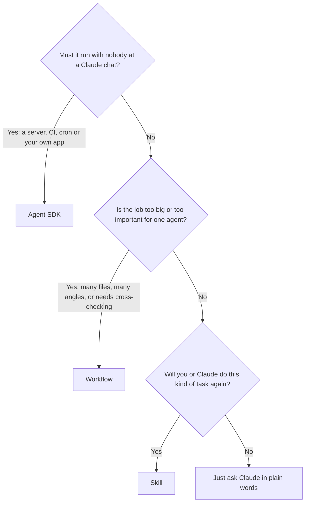
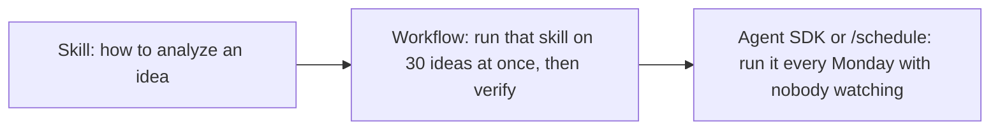

# Claude Code: Skills vs Workflows vs Agent SDK

Three ways to make Claude do a job the same way every time. They are often confused because all three "package up" work, but they solve different problems:

- A **Skill** teaches Claude *how* to do something. It is know-how that Claude loads when it needs it.
- A **Workflow** decides *who does what, in what order*. It is a script that runs many subagents in a fixed pattern inside your session.
- The **Agent SDK** decides *where Claude runs*. It puts the whole Claude Code agent inside your own program, so it can run with nobody at a terminal.

> Companion to [[claude-code-features-productivity-guide]] and [[claude-code-sdk-plugins-mcp-guide]]. Workflow details were checked against Claude Code v2.1.292 on 2026-10-07.

---

## 1. At a Glance

| | **Skill** | **Workflow** | **Agent SDK** |
|---|---|---|---|
| What it is | A folder with `SKILL.md` instructions, plus optional scripts and templates | A JavaScript script that spawns and coordinates subagents | A TypeScript/Python library that runs the Claude Code agent |
| Answers the question | "How should Claude do this task?" | "How do I split a big job across many agents and check their work?" | "How do I run Claude inside my own app, server or job?" |
| Who decides the steps | Claude, guided by your instructions | **Your script**: loops, fan-out, verify steps are fixed in code | Your code around it; Claude inside each `query()` |
| Where it runs | Inside any Claude session (Claude Code, claude.ai, API) | Inside a Claude Code session, in the background | Anywhere your code runs: server, CI, cron, your app |
| Needs a person present? | Yes, someone starts the chat | Someone starts it, then it runs on its own | No |
| How it starts | Automatically when a request matches its description, or `/skill-name` | Ask Claude to "use a workflow", the `ultracode` keyword, or a saved workflow by name | Your program calls `query()` |
| Effort to build | Minutes, it's mostly writing | An hour or so, it's a short script | Hours to days, it's a software project |
| Cost per run | Same as a normal chat | High: many agents in parallel | Whatever your program does |
| Typical size | One task | 5 to 100+ agents, one big job | One agent or many, long-running |
| Shareable via | Plugins, `.claude/skills/`, claude.ai | `.claude/workflows/` in the repo | Your own deployment |

---

## 2. Which One Should I Use?



**Rules of thumb:**
- Start with a **Skill**. Most repeat tasks just need Claude to know your steps, format or rules.
- Reach for a **Workflow** when one agent would run out of context, miss things, or be overconfident. Examples: auditing 200 files, researching 30 competitors, getting three independent reviewers to agree.
- Build with the **Agent SDK** only when the job must run on its own schedule or inside a product. For simple scheduled runs, try `/schedule` or `claude -p` in a cron job first. They need no code.

---

## 3. Skills

### When to use
- Repeat tasks with a house style: release notes, PR descriptions, weekly reports, the "idea analysis" format in this repo.
- Specialist know-how: how to edit `.docx` files, your deploy checklist, how your API is organized.
- Anything you keep pasting into prompts.

### When not to
- The job needs many agents at once → Workflow.
- It has to run unattended → Agent SDK or `/schedule`.
- It's a one-line rule for every session → put it in `CLAUDE.md` instead.

### How to set one up
1. Make a folder: `.claude/skills/<name>/` (this project) or `~/.claude/skills/<name>/` (all your projects).
2. Add `SKILL.md`:

```markdown
---
name: product-idea-analysis
description: Analyze a browser-extension or software product idea. Use when the user asks to evaluate, research or score a product idea.
---

# Product idea analysis

1. Restate the idea in one sentence and name the target user.
2. Search for 5 existing competitors; for each give price, rating and main complaint.
3. Score demand, competition, build effort and monetization from 1 to 5.
4. Write the result to `<product-name>-analysis.md` using the template in `template.md`.
```

3. Optionally add helper files next to it (`template.md`, scripts). Claude reads them only when the skill runs.
4. Test it: ask "analyze this idea: …" and check that the skill loads. Or type `/product-idea-analysis`.

**Tips:** The `description` decides when it triggers, so say *what it does* and *when to use it*. Keep `SKILL.md` short and put long reference material in separate files. Or ask Claude to *"use skill-creator to make a skill for X"*.

---

## 4. Workflows

A workflow is a short JavaScript script that Claude runs with the **Workflow** tool. It gives you a few building blocks:

| Building block | What it does |
|---|---|
| `agent(prompt, {schema})` | Starts one subagent; with a JSON schema it returns structured data |
| `pipeline(items, stage1, stage2…)` | Runs every item through each stage. No waiting between items, so it's the fast default |
| `parallel([...])` | Runs tasks at once and waits for all of them. Use when the next step needs every result |
| `phase()`, `log()` | Group and narrate progress, which you can watch in `/workflows` |
| `workflow(name)` | Runs another saved workflow as a step |

Up to about 16 agents run at once, and results are cached, so an interrupted run can be resumed without redoing finished agents.

### When to use
- **Big sweeps:** one agent per file, page, competitor or ticket, for example "check all 120 product listings".
- **Confidence:** independent reviewers that try to *disprove* each finding before you trust it.
- **Comparing options:** several independent designs, scored by separate judges.
- **Discovery of unknown size:** keep searching until two rounds in a row find nothing new.

### When not to
- A normal task one agent handles fine. A workflow costs many times more tokens.
- It needs to run while you're away from a session. Workflows run inside a Claude Code session; for scheduled runs, use `/schedule` (which can start a workflow) or the SDK.

### How to set one up
1. **Ask for it in your own words.** For example: *"Use a workflow to research these 20 competitors and verify each finding."* Claude writes the script and runs it. Workflows only run when you clearly ask: say "use a workflow", include **`ultracode`** in your prompt, or turn it on for the session with `ultracode on`.
2. **Watch it** with `/workflows`.
3. **Save it to reuse.** Ask Claude to save the script as `.claude/workflows/<name>.js` (project) or in your user folder. Next time: *"run the competitor-research workflow on these 5 ideas"*.

### Example: research and fact-check competitors

```js
export const meta = {
  name: 'competitor-research',
  description: 'Research each competitor, then fact-check every claim',
  phases: [{ title: 'Research' }, { title: 'Verify' }],
}

const FACTS = { type: 'object', properties: {
  name: { type: 'string' },
  claims: { type: 'array', items: { type: 'string' } } }, required: ['name', 'claims'] }
const VERDICT = { type: 'object', properties: {
  claim: { type: 'string' }, holds: { type: 'boolean' } }, required: ['claim', 'holds'] }

// args = ["Grammarly", "LanguageTool", ...]
const results = await pipeline(
  args,
  name => agent(`Research the product ${name}: pricing, users, top complaints.`,
                { phase: 'Research', schema: FACTS }),
  facts => parallel(facts.claims.map(c => () =>
    agent(`Try to disprove this claim with sources: "${c}"`, { phase: 'Verify', schema: VERDICT })))
)
return results.filter(Boolean).flat().filter(v => v && v.holds)
```

Each competitor moves to fact-checking as soon as its own research finishes. It doesn't wait for the others.

---

## 5. Agent SDK

### When to use
- **Unattended jobs:** a nightly agent that triages new issues, a CI step that fixes lint, a bot that answers support tickets.
- **Inside a product:** an "AI assistant" panel in your own app or extension backend.
- **Custom tools and control:** your own functions as tools, approving or denying each action in code, your own UI.

### When not to
- You just want Claude to follow your steps → Skill.
- A one-off big job → Workflow.
- A simple scheduled prompt → `/schedule` or `claude -p` in cron. No code needed.

### How to set one up
1. Install: `npm install @anthropic-ai/claude-agent-sdk` or `pip install claude-agent-sdk`, and set `ANTHROPIC_API_KEY`.
2. Prototype the task interactively in Claude Code first, often as a Skill.
3. Call `query()` with the prompt, allowed tools and permission mode. There are full examples in [[claude-code-sdk-plugins-mcp-guide]].
4. Set `settingSources: ["project"]` if you want it to load your `CLAUDE.md` and project skills, so the agent reuses the skills you already wrote.
5. Deploy it where it needs to run (server, GitHub Action, cron) with logging and a spending cap.

---

## 6. They Work Together

These aren't either/or. They stack:



A natural path for the product-ideas research in this repo:
1. **Week 1:** write a `product-idea-analysis` **Skill** so every analysis has the same format.
2. **Week 2:** when you have a batch of ideas, run a **Workflow**: one agent per idea using that skill, then fact-check agents.
3. **Later:** if you want a fresh report every Monday, schedule it with `/schedule`. Build an **Agent SDK** service only if it needs to live inside your own product or infrastructure.

---

## 7. Quick Reference

| I want to… | Use |
|---|---|
| Stop re-explaining my report format | Skill |
| Give Claude know-how about a file type, API or process | Skill |
| Review a large codebase or document set thoroughly | Workflow |
| Get several independent opinions and keep only what survives | Workflow |
| Research many items in parallel | Workflow |
| Run Claude on a schedule with no code | `/schedule` or `/loop` |
| Run Claude in CI | `claude -p` or the GitHub Action, then the SDK if you need more control |
| Put an agent inside my own app | Agent SDK |
