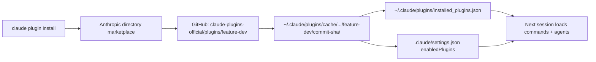
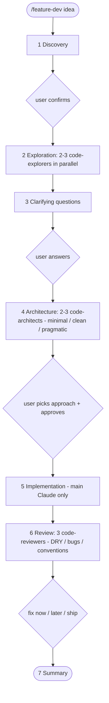

# feature-dev Plugin — Teardown

Research notes on Anthropic's `feature-dev` Claude Code plugin: how it is installed, what's inside, and how it works.

- **Source:** `anthropics/claude-plugins-official` → `plugins/feature-dev` (commit `d4226d0`)
- **Installed with:** `claude plugin install feature-dev@anthropic-plugin-directory --scope project`
- **Effect in this repo:** `.claude/settings.json` gains `"enabledPlugins": { "feature-dev@anthropic-plugin-directory": true }`

## Key Takeaways

- The plugin has **no executable code**: one JSON manifest plus four Markdown prompt files (~256 lines in total).
- Folder conventions wire everything up: `commands/*.md` → slash commands, `agents/*.md` → sub-agents.
- The main Claude is the orchestrator; three read-only specialist agents (explorer, architect, reviewer) run in parallel batches.
- Five human checkpoints are written into the playbook as hard "wait for the user" instructions.

## Install Pipeline

The manifest has no `version`, so Claude Code derives one from the commit hash (`d4226d062928-704ea414`); `claude plugin validate` warns about this.

## Anatomy

| File | Lines | Role |
|------|------:|------|
| `.claude-plugin/plugin.json` | 8 | Manifest: name, description, author |
| `commands/feature-dev.md` | 125 | The `/feature-dev` playbook (7 phases); `$ARGUMENTS` receives the user's request |
| `agents/code-explorer.md` | 51 | Traces existing code; must return 5–10 key files |
| `agents/code-architect.md` | 34 | Produces one decisive implementation blueprint |
| `agents/code-reviewer.md` | 46 | Reviews `git diff`; reports only issues scored ≥ 80/100 |
| `README.md`, `LICENSE` | 412, 202 | Human docs, Apache 2.0 (not read at runtime) |

All three agents share: `model: sonnet`, and a read-only tool list (`Glob, Grep, LS, Read, NotebookRead, WebFetch, TodoWrite, WebSearch, KillShell, BashOutput`) — no `Edit`, `Write` or `Bash`.

## Workflow

## Design Patterns Worth Reusing

1. **Orchestrator–workers:** sub-agents burn context on searching; the main agent keeps only their reports.
2. **Read-only workers:** only the agent with user approval edits files.
3. **Reading lists:** workers return file lists; the orchestrator reads those files itself.
4. **One agent, many briefs:** diversity comes from the task message (3 architect focuses from 1 file).
5. **Explicit gates:** "CRITICAL", "DO NOT SKIP", "DO NOT START WITHOUT USER APPROVAL".
6. **Confidence threshold:** reviewer scores issues 0–100 and drops anything < 80.

## Observations

- README says reviewer output includes "Important (50–74)" issues, contradicting the agent's own ≥ 80 cut-off.
- Agent tool lists reference older tool names (`LS`, `NotebookRead`, `KillShell`, `BashOutput`).
- Built for real codebases; this Markdown-only repo gives the explorers/reviewers little to trace.
